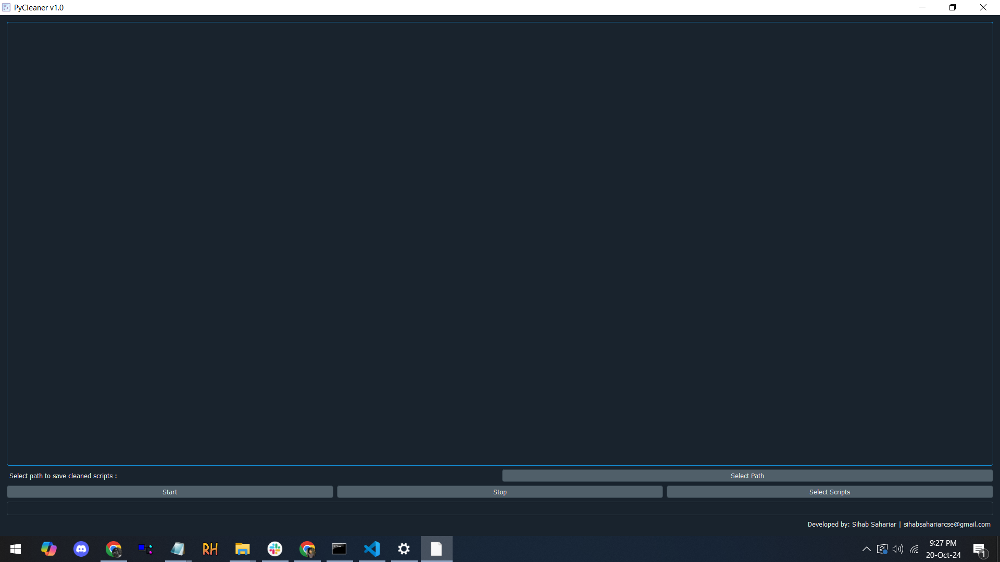

# PyCleaner: A Python Script Cleaning Tool  
**Developer**: Sihab Sahariar  
**Contact**: [sihabsahariarcse@gmail.com](mailto:sihabsahariarcse@gmail.com)

**PyCleaner** is a streamlined and efficient desktop application designed specifically for Python developers who need to clean their scripts by automatically removing comments. This tool provides a hassle-free solution for handling multiple scripts, ensuring that comments are stripped away without compromising the structure or readability of the code.

## Key Features:

1. **Multi-Script Management**: PyCleaner allows users to select and process multiple Python scripts at once. Users can either drag and drop their scripts or choose files via the file selection dialog, making batch processing convenient and quick.

2. **Intelligent Comment Removal**: The application detects and removes comments (lines starting with `#`) throughout the script, whether they appear at the beginning or in the middle of the line. It retains proper formatting, ensuring that line breaks and empty lines are preserved, maintaining the original structure of the code.

3. **Custom Save Directory**: Users can define a custom path for saving cleaned scripts, ensuring the original files remain unmodified. The cleaned versions are neatly saved in the specified folder, allowing safe script editing.

4. **Real-Time Progress Tracking**: The built-in progress bar displays the status of the ongoing cleaning process, showing users exactly how much of the task is completed as PyCleaner works through each script.

5. **Control Over the Process**:
   - **Start**: Users can initiate the cleaning process, with PyCleaner automatically processing each selected script, removing comments, and saving the cleaned versions.
   - **Stop**: Users can halt the operation at any time, giving them control over the process in case they need to stop midway.
   - **Select Path**: This feature allows users to define where they want the cleaned scripts to be saved.

6. **User-Friendly Interface**: PyCleaner offers an intuitive, minimalistic interface that is easy to navigate. The drag-and-drop feature adds convenience, making it quick to load and manage scripts for cleaning.

## Ideal For:
- **Python Developers**: Whether you're preparing scripts for deployment, sharing with a team, or archiving clean versions, PyCleaner is an essential tool for automating the comment-removal process while preserving code readability.
  
## Screenshot:

For inquiries, feedback, or further information, feel free to reach out to the developer:

**Sihab Sahariar**  
**Email**: [sihabsahariarcse@gmail.com](mailto:sihabsahariarcse@gmail.com)

